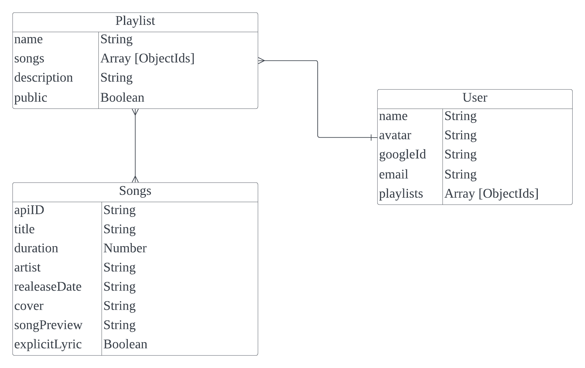
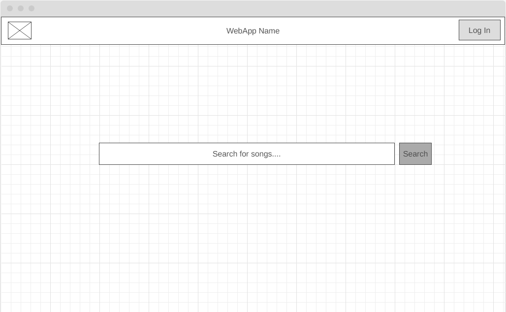
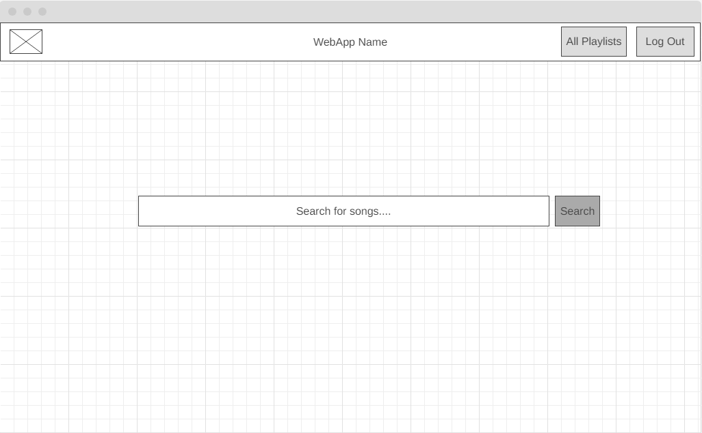
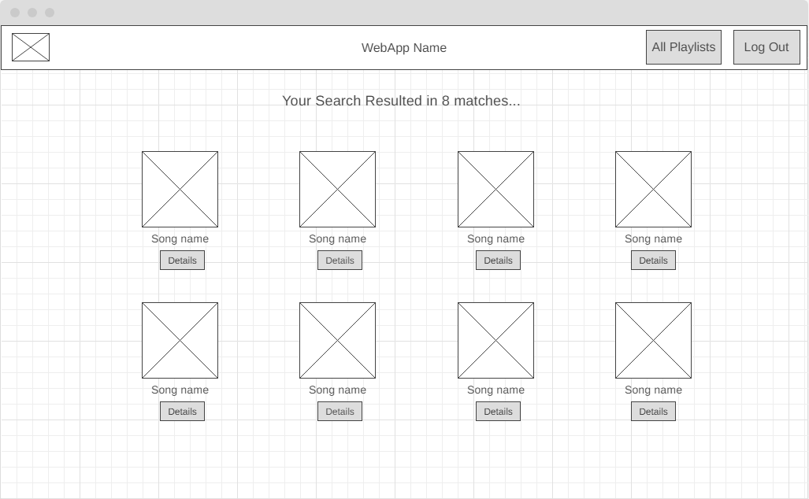
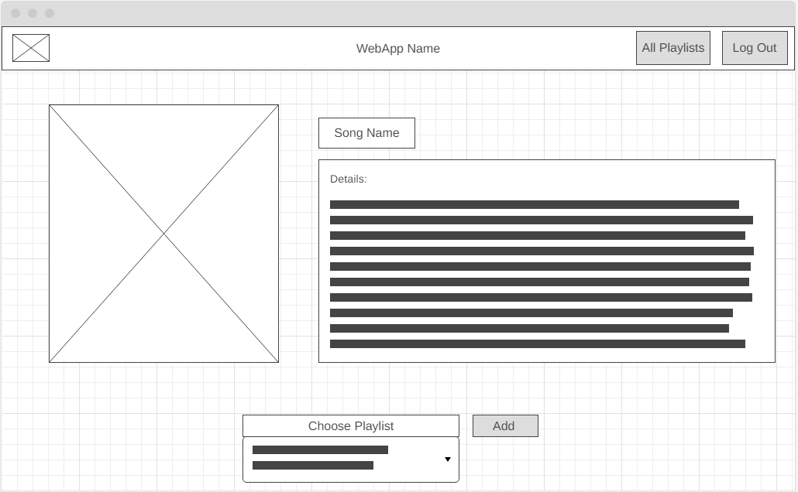
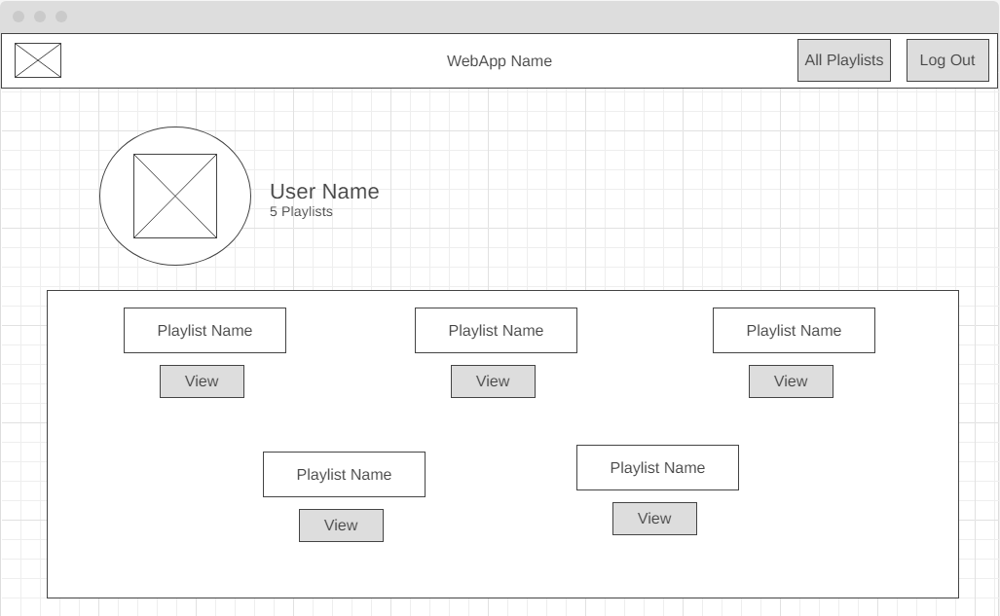
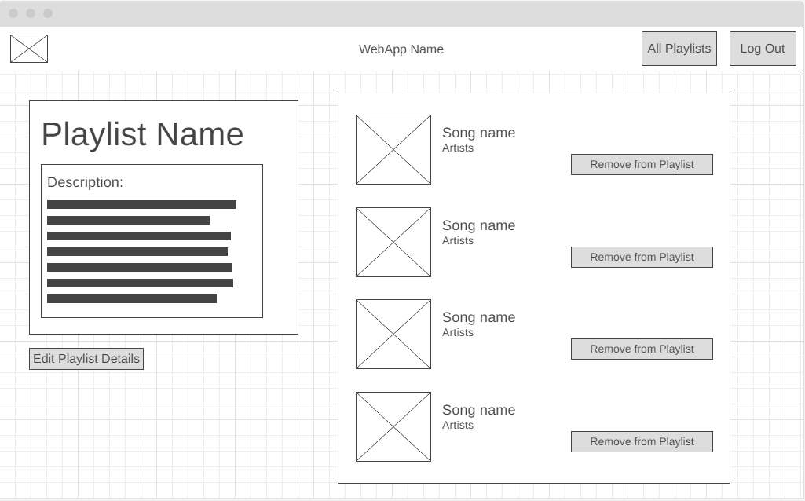
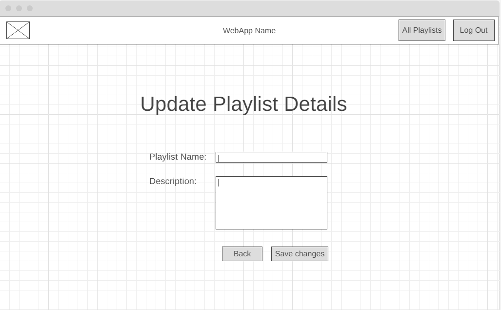

# MAaaPlaylist

## About the app
> The app is a playlist organization tool that allows users to curate personalized playlists. Users must authenticate via Google OAuth to gain access to the app and their created playlists. Without authentication, visitors will be restricted to onlu using the song search feature along with the ability to view public playlists.

## Naming the app
> The app's name was conceived as a playful pun, incorporating the goat as an inspirational animal and featuring it in the app's logo. The "MAaa" segment of the name represents the characteristic call of a goat, resembling the sound "my" as well. Thus, instead of "my playlist," the "my" is humorously replaced with "MAaa," resulting in the name MAaaplaylist.

## link to Trello board and App

[MAaaplaylist](https://maaaplaylist.fly.dev/) | [Trello](https://trello.com/b/nfH5tSJv/playlist-app)

## Development Outline

> The site was developed using the Express JS framework. A dedicated API was used to fetch songs and their details. User are able to add songs to their playlist. The site was developed and designed using the conceptualized ERD below. The ERD has three entities (Playlist, Song, and User) connected with two relationships (Playlist - Song and User - Playlist).

**Users**

- The users will be able to log in on the platform by linking their Google account.

**Playlists**

- The site users can create multiple playlists to organize their favorite songs
- Each playlist has a name and a description to give context to its content.
- Users can add songs to their playlists. The songs attribute in the Playlist entity stores references (ObjectIds) to the songs included in the playlist.

**Songs**

- Each song has a name, genre, artist(s), release year, and cover art.
- Genres and artists are stored as arrays of strings, allowing a song to be associated with multiple genres and artists if necessary.
- The cover attribute stores a URL or file path pointing to the cover art for the song.

> The wireframe of the conceptualized site are detailed below. The landing page will be a search bar with a navigation bar on the top which will have the Google Oauth login link and a link to display all the playlists. The specific pages of the site is detailed below.

## **The landing page without user authentication**

> 

The landing page after the user logs in will have a search bar that users can use to browse the available songs.

**The landing page with user authentication**

> 

The landing page after the user logs in will have a search bar that users can use to browse the available songs.

**The search results**

> 
> The search results will be displayed as horizontally across the page. Users will be able to see the songs’s name as well as its cover

**Song details**

> 

When users select a certain song, a new page will open. The page will display additional details of the song. The users will then have the opportunity and the option to add the song to a playlist

**All playlists**

> 

The users will be able to display all their playlists. The playlists will contain the name of the playlist as well as the option to display the details of the playlist

**Playlist details**

> 

The playlist details will show only the selected playlist and give the user an opportunity to edit and delete the playlist

**Edit playlist details**

> 

When the user selects a playlist to edit its details, the playlist details page will give the user the option to update the playlist name and the description.

## Team

The building of the site will be a team effort. The team was composed of:

- [Mariam](https://github.com/MariamBaloch)
- [AbdulRahman](https://github.com/aboodabdo347)
* [Nabeel](https://github.com/nabeelmaklai)

The collaboration was organized using a [Trello](https://trello.com/b/nfH5tSJv/playlist-app) board linked

## :computer: Technologies Used

- 
- 
- 
- 
