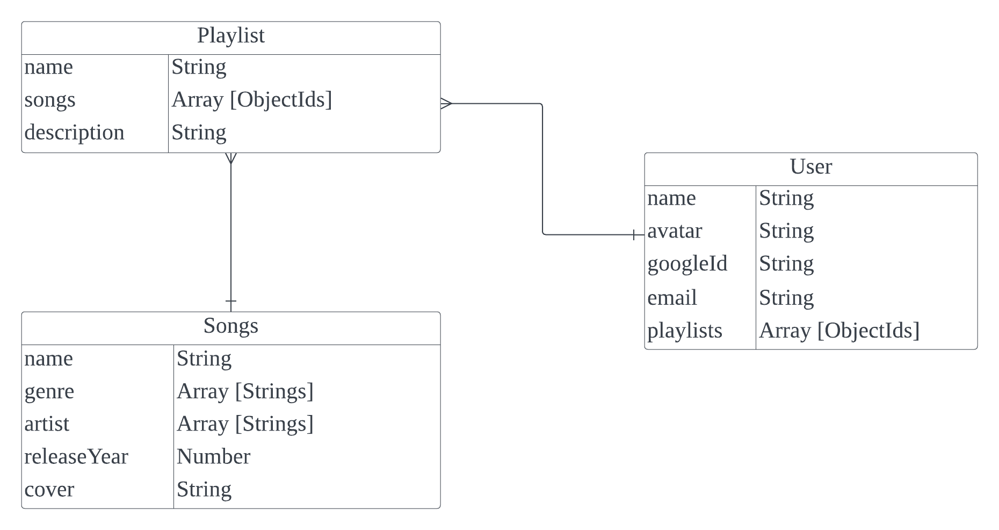

# awsome-playlist-app-5000

## About the site

> The app will allow users to create a personalized playlist. The app’s user need to be authenticated using Google Oauth to have access to the app and the created playlists. Without any authentication, users of the site will only have access to the song search function.

## Development Outline

> The site will be developed using the Express JS framework. A dedicated API will be used to fetch songs and the details of these songs to be added to the user's playist. The site will be developed and designed using the the conceptualized ERD below. The ERD will have three entities (Playlist, Song, and User) connected with two relationships (Playlist - Song and User - Playlist).

**Users**
* The users will be able to create accounts on the platform, which will require providing a name, email, and possibly linking their Google account (googleId)

**Playlists**
* The site users can create multiple playlists to organize their favorite songs
* Users Each playlist has a name and a description to give context to its content.
* Users can add songs to their playlists. The songs attribute in the Playlist entity stores references (ObjectIds) to the songs included in the playlist.

**Songs**
* Each song has a name, genre, artist(s), release year, and cover art.
* Genres and artists are stored as arrays of strings, allowing a song to be associated with multiple genres and artists if necessary.
* The cover attribute stores a URL or file path pointing to the cover art for the song.

## :computer: Technologies Used

- 
- 
- 
- 

