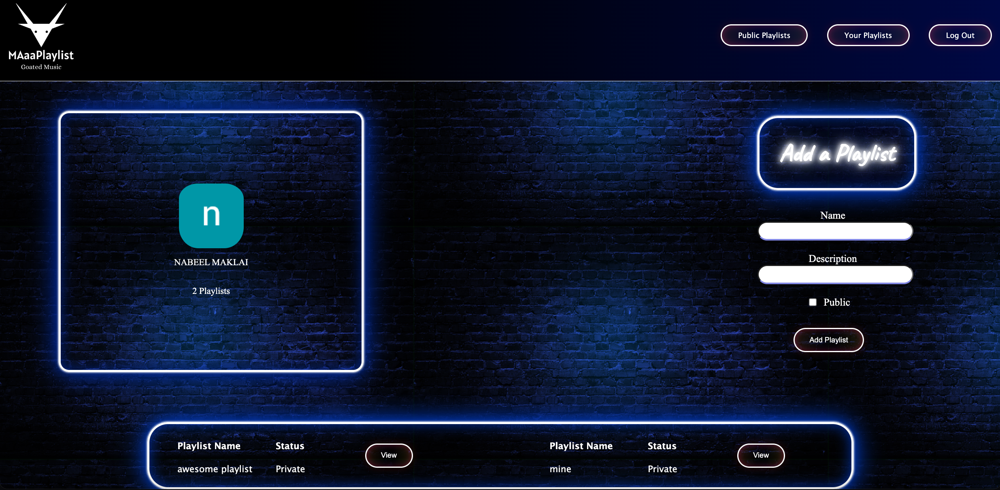

# MAaaPlaylist

## About the app
> The app is a playlist organization tool that allows users to curate personalized playlists. Users must authenticate via Google OAuth to gain access to the app and their created playlists. Without authentication, visitors will be restricted to onlu using the song search feature along with the ability to view public playlists.

## Naming the app
> The app's name was conceived as a playful pun, incorporating the goat as an inspirational animal and featuring it in the app's logo. The "MAaa" segment of the name represents the characteristic call of a goat, resembling the sound "my" as well. Thus, instead of "my playlist," the "my" is humorously replaced with "MAaa," resulting in the name MAaaplaylist.

## Team

The building of the site will be a team effort. The team was composed of:

- [Mariam](https://github.com/MariamBaloch)
- [AbdulRahman](https://github.com/aboodabdo347)
- [Nabeel](https://github.com/nabeelmaklai)

The development of the app was organized using a Trello board linked below. 

## link to Trello board and App

[MAaaplaylist](https://maaaplaylist.fly.dev/) | [Trello](https://trello.com/b/nfH5tSJv/playlist-app)

## Development Outline

> The site was developed using the Express JS framework. A dedicated API was used to fetch songs and their details. User are able to add songs to their playlist. The site was developed and designed using the conceptualized ERD below. The ERD has three entities (Playlist, Song, and User) connected with two relationships (Playlist - Song and User - Playlist).

**Users**

- The users will be able to log in on the platform by linking their Google account.

**Playlists**

- The site users can create multiple playlists to organize their favorite songs
- Each playlist has a name and a description to give context to its content as well as the option to make the playlist public.
- Users can add songs to their playlists. The songs attribute in the Playlist entity stores references (ObjectIds) to the songs included in the playlist.

**Songs**

- Each song has various details such as name, duration, artist(s), release date, song preview and cover art.
- The cover attribute stores a URL or file path pointing to the cover art for the song.

## App screenshots

#### **The landing page**

This is the landing page with and without user authentication. It includes a search bar to search for songs as well as an advanced search option that allows users to search by artist name. When the user is logged in, the landing page also has the link to view their personal playlists. 

> 

#### Song search results 

The search results are identical for both authenticated and unauthenticated users.

> 

#### Song details without authentication

The song details page includes details on the song and the ability to play a short clip of the song in the browser

> 

#### Song details with authentication

If the user is authenticated, the song details page has the option to add the song to a playlist.

> 

#### Creating and viewing the playlists

The logged in users of the app can view their playlists and create their new playlists if they wish

> 

#### Playlist details

Loggedin users of the app can view the songs theyve added into their playlists with the option to edit and delete the songs inside the playlist or even teh whole playlist

> 

#### Public playlists

Playlists that users choose to be displayed publically can be viewed by all users of the app

> 

The collaboration was organized using a [Trello](https://trello.com/b/nfH5tSJv/playlist-app) board linked

## :computer: Technologies Used

- 
- 
- 
- 
